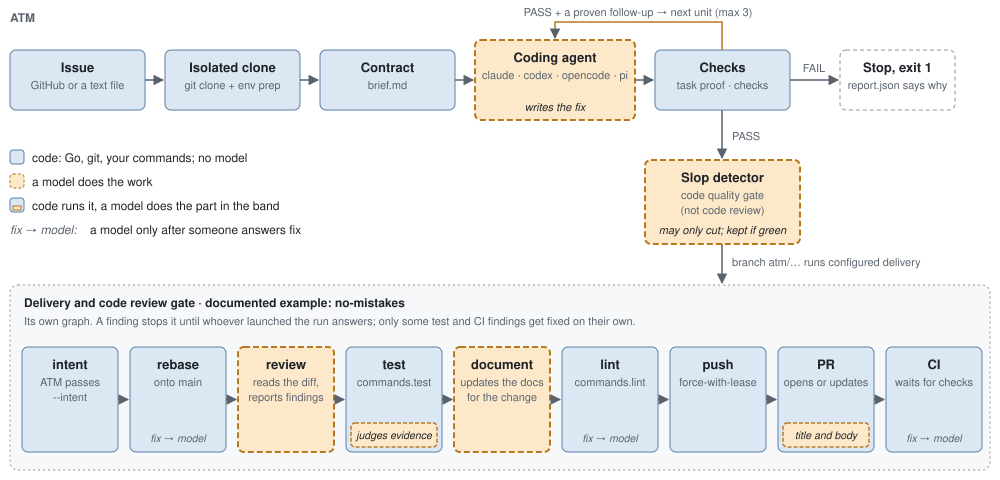

# ATM, Agentic Team Member

> The coding agent is one node. Every edge is decided by code.

[](https://github.com/thellmwhisperer/agentic-team-member/actions/workflows/pr.yml)


[](LICENSE)

<picture>
  <source media="(prefers-color-scheme: dark)" srcset="docs/assets/pipeline-dark.svg">
  
</picture>

Give ATM an issue, from GitHub or a text file. It hands the issue to a coding
agent you already pay for (Claude Code, Codex, OpenCode or pi) inside an
isolated clone, with a written contract. Then code, not the agent, decides:
does the new test fail without the fix and pass with it, do the suite and
typecheck still pass, did the diff stay inside the issue. A green run gets one
more agent call, the slop detector, that may only delete. Then the delivery and
code review gate takes the branch.

## A real run

Issue 130 of this repo, 5 October 2026, Claude Opus 5.5, effort high: every
step of a run reports live, and no run starts without a monitor. 14 min 01 s,
55 agent turns, five red tests first, red and green verified, 3 cuts kept by
the slop detector, [PR 136](https://github.com/thellmwhisperer/agentic-team-member/pull/136)
merged, issue closed.

```text
PREPARE   worktree .worktrees/atm-run-20261005-225238-2   base 670a60faa0   tests python3 -m pytest

AGENT  unit 1 claude
  ✎ Reading the worker, the renderer and the tests before writing the red test.
  ✎ Writing the red tests first.
  ▶ #13 Edit  tests/test_harness_worker.py                                    ✓ ok
  ▶ #17 Bash  cat >> tests/test_tail_run.py <<'EOF' def test_tail_renders_step_starts_ends_…
  ▶ #18 Bash  python3 -m pytest -q tests/test_harness_worker.py -k "full_suite_says"   ✗ AssertionError: '▶ full suite' not in …
  ✎ All five red. Now the worker: a `RunLog` that replaces `make_logger`.
  ▶ #19 … #31 Edit  agentic_tdd_runner/harness_worker.py                         ✓ ok
  ✎ Now wiring the steps into `main`.
  ✎ Now the ponytail pass.
  ✎ Now the renderer side in `scripts/tail-run.py`.
  ▶ #38 Bash  python3 -m pytest -q tests/test_tail_run.py tests/test_harness_worker.py  ✓ ok
  ▶ #43 Edit  config/agent.toml                                                 ✓ ok
  ✎ Aviso: I edited the README of the main checkout by mistake, not the worktree one. Reverting it there and applying it in the worktree.
  ✎ No other launcher in the repo. Running the full lint and the full suite.
  ✓ agent finished  turns=55

RED / GREEN VERIFICATION
  ✓ without the fix   test fails    4 failed, 64 passed in 1 min 34 s
  ✓ with the fix      test passes
  ✓ quality  ✓ gate  ✓ full suite  ✓ scope  ✓ follow-up validation

AGENT  ponytail claude
  ✎ harness_worker.py: `elif run_log.steps and …` is now a plain `else`; verify_red_green always prints the half (speculative_hardening)
  ✎ harness_worker.py: removed the `self.steps and` guard in `RunLog.tick`; both callers check under the lock (speculative_hardening)
  ✎ harness_worker.py: inlined the `NO_MONITOR` constant into its one `print` (speculative_feature)
  ✓ agent finished  turns=6
  ✓ ponytail re-checks   red/green, quality, gate, full suite, scope: all green again

SUMMARY
  harness   claude model=claude-opus-5-5 effort=high exit=0
  duration  14 min 01 s   units=1/3
  changed   harness_worker.py, tail-run.py, agent.toml, README.md, test_harness_worker.py, test_tail_run.py   +369 −56
  checks    ✓ red/green   ✓ quality   ✓ gate   ✓ scope   ✓ full suite   – typecheck n/a
  ponytail  kept, 1 net line saved, 3 tombstones written
✓ RESULT  PASS
```

The agent's own red (`#18`) is a courtesy. The verdict is the RED / GREEN
block: ATM parks the fix, runs the test, brings the fix back, runs it again.
The `Aviso` line is the agent catching itself editing outside the clone; the
scope check would have caught it too. This run is the one that taught ATM to
print its steps live: the lines with a duration in the runs after it exist
because of it.

## Who decides what

| Step | Who | Says no to |
|------|-----|-----------|
| Clone, environment, contract | code | a dirty clone, a missing test runner |
| Write the fix | **model** | nothing: it decides nothing |
| Red / green | code | a test that passes without the fix; a red that only fails on a missing import |
| Gate and scope | code | agent commits; test-only diffs; files outside the issue |
| Quality, suite, typecheck | code | lint, forbidden patterns, test smells, any failure |
| Follow-ups | code (+ optional model) | a gap without a red test on code that already exists |
| Slop detector (code quality gate, not code review) | **model**, may only cut | a cut that breaks any check or does not shrink the diff: the clone goes back |
| Delivery and code review gate | your command | ATM branches, commits and runs it. The shipped example is no-mistakes, a graph of its own: models review, judge the test evidence, update the docs and write the PR; code rebases, runs your test and lint commands, pushes and watches CI |

Two more optional model calls never pass a unit on their own: a local Ollama judge
for duplicated test setup, and TypeSafe's Jev for follow-ups. Step by step,
with the function behind each one: [How a run flows](docs/how-a-run-flows.md).

## Run the Python worker

```bash
git clone https://github.com/thellmwhisperer/agentic-team-member.git
cd agentic-team-member && pip install -r requirements.txt   # Python 3.12+, git, gh, one agent CLI

# A GitHub issue
python3 -m agentic_tdd_runner.harness_worker --repo /path/to/repo \
  --github-repo owner/repo --issue-number 300 --harness claude --model claude-opus-5-5

# A plan in a text file: first line the title, then the body and its acceptance criteria
python3 -m agentic_tdd_runner.harness_worker --repo /path/to/repo \
  --issue-file plans/retry-on-timeout.md --harness codex --model gpt-6 --label retry
```

| Exit | Meaning |
|------|---------|
| `0` | Every unit passed, and delivery, if configured, exited 0 |
| `1` | A unit failed; nothing is delivered |
| `2` | Preparation failed, the label is taken, or there is no monitor and no terminal |
| `4` | Every unit passed, but the delivery command exited non-zero |

ATM is built to be launched and watched by an agent. `[monitor].command` runs
at every step start and end, so the launching agent knows where the run is
without reading its output; with no monitor, the worker wants a terminal.
`--dry-run` prints the contract and stops. `--label NAME` puts the run in
`<[runs].dir>/NAME` (`~/.atm/runs` as shipped). `scripts/tail-run.py --label NAME`
reads the same `[runs].dir` and follows it from another terminal. Delivery is whatever `[delivery].command` says; the shipped
example hands the branch to [no-mistakes](https://github.com/kunchenguid/no-mistakes).
Leave it empty and the green work stays in the clone.

## Go port: issue step

From inside the target repository, `atm run <issue.md | issue number>` loads
the required `.atm.yaml` and reads the issue as one step. It emits JSON start
and result events. The Go port stops after this step for now; it does not run
the configured commands or deliver a branch yet. See [Go port configuration](docs/configuration.md#go-port-configuration)
for the issue format and YAML keys.

## Read more

- [How a run flows](docs/how-a-run-flows.md): every step, the function, what it writes.
- [Configuration](docs/configuration.md): every flag and key, its default, who reads it.
- [ATM maintains itself](docs/self-maintenance.md): this repo's own fixes go through ATM; the hooks that hold the loop.
- [Contributing](CONTRIBUTING.md) · [Security](SECURITY.md) · [Code of conduct](CODE_OF_CONDUCT.md)

## Status

Alpha. Full tooling for JavaScript and TypeScript; Python with pytest and
ruff; Go with `go test` and `go vet` once the runner line is set. The contract,
the report and the flags can still change. Open work is in the
[issues](https://github.com/thellmwhisperer/agentic-team-member/issues).

Apache 2.0. [LICENSE](LICENSE) · [NOTICE](NOTICE)
