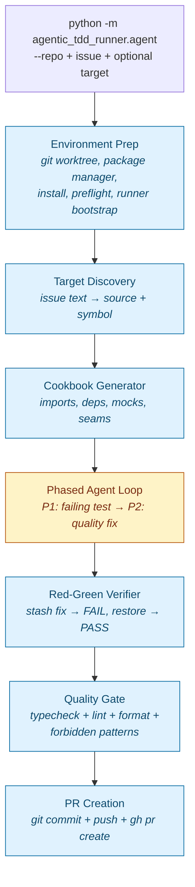
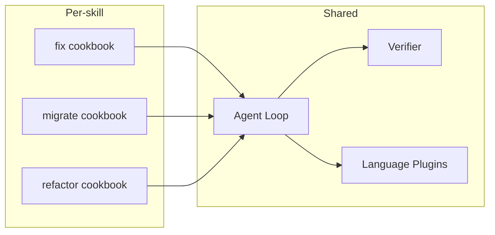

# ATM — Agentic Team Member

> Point a local LLM at a bug. Get back a fix with tests, a verified red-green, and a PR.

[](#status)
[](#requirements)
[](LICENSE)
[](#status)

ATM is a small Python harness that turns a local code model (for example Qwen
3.6 MTP on [llama-server](https://github.com/ggml-org/llama.cpp), or another
OpenAI-compatible local endpoint)
into a **TDD bug-fix agent** for your repository. No model API key — your code
is never sent to a hosted inference provider. (GitHub auth via `gh` is still
required for issue ingestion and PR creation.)

It does the work an engineer would do on a single, well-scoped issue: read
the code, write a failing test, fix the bug, verify red-green, and open a PR.

> **Status: alpha.** ATM is a research-grade harness. APIs, config
> schema, prompt templates, and the verify contract can change without
> notice. Empirical coverage is uneven across code shapes — see
> [Coverage](#coverage) (25% strong / 40% partial / 35% weak). Not
> production-ready. Use on disposable branches and review every PR
> before merging.

---

## Table of contents

- [Why local-first](#why-local-first)
- [Quick look](#quick-look)
- [Execution targets](#execution-targets)
- [How it works](#how-it-works)
- [The cookbook](#the-cookbook)
- [Skills](#skills)
- [Coverage](#coverage)
- [Language plugins](#language-plugins)
- [Configuration](#configuration)
- [Installation](#installation)
- [Usage](#usage)
- [Roadmap](#roadmap)
- [Status](#status)
- [License](#license)

---

## Why local-first

Most coding agents assume a frontier model behind a paid API. ATM assumes the
opposite: a 4B–27B model running on your laptop or workstation, with a 32k
context window and no network egress.

That constraint shaped every design decision:

- **Deterministic prep does the thinking the model can't.** Local models can
  write code, but they get lost in dependency graphs. ATM parses imports,
  traces factory calls, classifies module-level mutables, and hands the model
  a ready mock recipe before the first turn.
- **Phased prompting beats clever planning.** Two short, focused phases
  (test-first, then quality-fix) outperform open-ended ReAct loops on a small
  model.
- **The contract is explicit.** Red-green verification and a deterministic
  quality gate sit between the model and your branch. The model can't ship a
  fix that doesn't reproduce and resolve the failure.

---

## Quick look

```bash
# 1. Start a local model server with the local target profile
cp targets/local/.env.example targets/local/.env.local
# edit targets/local/.env.local for your llama-server binary and local config
make -C targets/local start-model

# 2. Point ATM at a GitHub issue
python3.12 -m agentic_tdd_runner.agent \
  --repo /path/to/your/repo \
  --github-repo your-org/your-repo \
  --issue-number 41
```

ATM clones a detached worktree under `your-repo/.worktree/`, runs environment
prep, generates a cookbook for the target function, then drives the model
through a two-phase TDD loop. If everything goes green, it commits and opens a
PR via `gh`.

---

## Execution targets

ATM has one canonical harness: `agentic_tdd_runner`. Execution targets describe
how to operate that harness in a specific environment without forking it.

| Target | Path | Purpose |
| --- | --- | --- |
| Local | [`targets/local`](targets/local) | Run ATM on a developer machine with `llama-server` or another local OpenAI-compatible endpoint. |
| AWS AgentCore | [`targets/aws-agentcore`](targets/aws-agentcore) | Optional hosted execution target for AWS AgentCore and Bedrock. |

Target-specific settings belong in `.env.local`, `*.local.toml`, cloud secret
stores, or target-local docs. The core harness remains AWS-agnostic and should
not import deployment-specific code.

---

## How it works



Blue blocks are deterministic Python. The single yellow block is where the
local model runs. Each deterministic block in front of the model is one less
round-trip, one less chance for the model to drift, and one less surface for
unverified output to slip through.

---

## The cookbook

Local models can fix source code but cannot resolve complex mocking graphs.
The cookbook is the semantic prep that closes that gap — deterministic static
analysis of the target function, emitted as ready-to-use context for the
model.

| Cookbook output        | What it solves                                                                                  |
| ---------------------- | ----------------------------------------------------------------------------------------------- |
| Import map             | Resolves `from x import y` and `import { y } from "x"` across TS/Python                         |
| Dependency graph       | Factory results (`const log = getLogger()`) vs singletons vs mutable locals (`let client`)      |
| Mock recipes           | `mock.module()` for imports, setter injection for module-level mutables                         |
| Module-level factories | Includes deps that execute on import even if the target function doesn't use them directly     |
| Assertion ranking      | Outbound calls scored (`say` > `emit` > `info` > `get`); calls on parameters skipped           |
| Class vs function      | Detects methods vs top-level functions; emits correct import + instantiation in the scaffold    |
| Test scaffold          | A ready-to-fill test file with imports, mocks, seams, and a single test block                   |

Everything in the cookbook is deterministic Python — no LLM is involved in its
generation. The model only sees the result.

---

## Skills

ATM is one agent with multiple skills. Each skill is a different cookbook —
the agent loop, verifier, and language plugins are shared. Teaching ATM a new
skill means writing a new cookbook, not a new agent.



| Skill      | Status     | What it does                                                                          |
| ---------- | ---------- | ------------------------------------------------------------------------------------- |
| `fix`      | ✅ shipped | Analyze a bug, write a failing test, fix the source, verify red-green, open a PR      |
| `migrate`  | 🛠 planned | Read a dependency upgrade guide, extract rules, apply file-by-file with verification  |
| `refactor` | 🛠 planned | Large-scale codemods guided by rules — an agent that understands the code, not regex  |

### Why `migrate` matters

Dependabot opens a PR bumping a dependency from v3 to v4, but it doesn't fix
the breaking changes. You read the migration guide, understand what broke, and
fix it file by file. Renovate doesn't fix this either. A local-first agent
with a cookbook that ingests the upgrade guide is the right shape for that
gap.

### The skill pattern

Every skill follows the same three-step architecture:

1. **Cookbook** (deterministic) — analyze the problem, generate an artefact
2. **Agent** (LLM) — execute the plan with tools
3. **Verifier** (deterministic) — confirm the work is correct

What changes between skills is step 1. The cookbook is the semantic layer —
it's what turns a generic model into a specialist.

---

## Coverage

ATM works on the *shape* of code it has been proven against — not on
"any TypeScript or Python bug." The matrix below tracks empirical
coverage by code shape, weighted by how often that shape shows up in
real issues.

| Code shape                              | Weight | Status  | Evidence                                                                                  |
| --------------------------------------- | -----: | ------- | ----------------------------------------------------------------------------------------- |
| Handlers, callbacks, event listeners    |    25% | strong  | End-to-end fix on an event-handler function: incoming event → outbound client call        |
| Services and classes with dependencies  |    20% | weak    | Multi-provider service class with constructor deps: invalid import shape, weak modeling   |
| API and SDK integrations                |    20% | partial | Observed run shipped a retry utility but left the API callsites identified by discovery untouched |
| CLI, scripts, and pipelines             |    15% | weak    | Discovery ranks `main()` entrypoints without classifying them as glue vs target           |
| Persistence, config, filesystem         |    12% | partial | Env / config / schema facts exist, no unified fix strategy                                |
| Pure functions and helpers              |     8% | partial | Generator-with-persistent-state shape: function found, but module-state ownership weak    |

Weighted view: **25% strong / 40% partial / 35% weak**.

Full ontology, signals per shape, test strategies, and the verify v2
contract live in [`docs/code-shape-coverage.md`](docs/code-shape-coverage.md).

### Verify v1.0 gate

`verified=True` is **not** "a new test fails, a new file is added, and
the test passes." It is:

- If discovery produced candidates, the diff must touch at least one of
  those paths.
- If discovery produced nothing, the diff must touch at least one
  pre-existing source path in the target repo — not only newly created
  helper or test files.

Issue-obligation-aware gating (v2.1, callsite-aware) is on the roadmap.

### Known fail modes

- **`body-identifies-but-fix-doesnt-address`** — observed in an
  `api_sdk_integration` run. The PR body correctly identified that two
  external API call families were missing retry logic, but the diff only
  added a standalone retry utility and its unit tests. The v1.0 gate
  rejects this run because the diff touches zero `discovery_candidates`
  paths.

### Defaults

- **Partial PRs are off by default.** When obligations are missing, the
  runner halts before PR creation unless partial mode is explicitly
  enabled. A partial PR cannot be titled as a complete `fix`.
- **Real `sleep()` in retry/backoff tests is a hard reject** for the
  `api_sdk_integration` shape when the issue text contains retry or
  backoff language. Other shapes start with a soft warning until more
  empirical evidence accumulates.

---

## Language plugins

Languages are plugins. Adding a new language requires zero changes to existing
code — drop a module in `agentic_tdd_runner/languages/` and implement nine
hooks:

```text
agentic_tdd_runner/languages/
  __init__.py
  typescript.py   # TS/JS: bun:test/jest/vitest, mock.module(), export detection
  python.py       # Python: pytest, unittest.mock, class method support
  signature.py    # Shared helpers for parsing parameter lists
```

Each plugin implements: `parse_imports`, `parse_assignments`, `test_path`,
`is_exported`, `import_path`, `prepend_export`.

---

## Configuration

Per-run configuration is loaded directly from TOML. The authoritative set of
checked-in defaults is [`config/agent.toml`](config/agent.toml); local overrides
should use ignored `*.local.toml` files. The former separate `tools.json` file
is no longer used.

### Repository profile

Optional stable repository facts live in `.atm/profile.toml`. Use this file
for callback frameworks, dependency contracts, import expectations, and mock
recipes that are true for the repository across issues. ATM does not infer
dependency-specific callback contracts from installed packages when no profile
is present; repos that need those contracts should add a profile before relying
on issue-only discovery.

The `[prompt].quality_failed` message is configurable in `config/agent.toml`.
Verification behavior is defined by the runner, not by a `[verification]`
configuration section.

With environment prep enabled, ATM inspects the nearest `package.json` and
lockfile before the model starts. For focused JS test runs it uses the detected
runner when it is one of the supported families:

| Detected runner | Focused command prefix |
| --------------- | ---------------------- |
| `bun:test`      | `bun test`             |
| `vitest`        | package-manager wrapper + `vitest run` |
| `jest`          | package-manager wrapper + `jest --runInBand --watchman=false --coverage=false` |
| `node:test`     | `node --test`          |

Bootstrap facts are the source of truth once detected: prompts, cookbooks,
permission grants, and focused verification commands must not reintroduce
stale language defaults such as `bun test`. Custom package scripts derive a
focused prefix from the script when possible, otherwise they use the package
manager's test script entrypoint. Unknown or ambiguous runner facts fall back to
`[runner].command`.
For detected JS runners, environment prep also runs a lightweight version
preflight (`bun --version`, `node --version`, or package-manager wrapper +
`runner --version`) before the first model tool call. That catches missing local
runner installs while the failure is still deterministic setup, not agent work.
Tool execution already runs inside the selected workdir, so generated commands
should use relative paths directly (`bun test src/foo.test.ts`) instead of
shelling through `cd path && ...`.
When a Next.js Jest project has a TypeScript/workspace-coupled Jest config,
environment prep writes a local `.atm-jest.config.cjs` shim and focused Jest
runs pass it via `--config` instead of editing the original project config.
That shim is a bootstrap fallback, not a pass-through clone of the original
config: it does not preserve custom keys such as `moduleNameMapper`, custom
`transform`, reporters, or coverage thresholds. For non-trivial Next.js Jest
configs, set `[runner].command` explicitly until ATM can safely preserve those
project-specific settings.

---

## Installation

```bash
git clone https://github.com/thellmwhisperer/agentic-team-member.git
cd agentic-team-member
pip install 'requests>=2.31,<3'
```

There is no published package yet — clone and run from source.

---

## Requirements

- Python 3.12+
- [`requests`](https://pypi.org/project/requests/)
- A local LLM server — [llama-server](https://github.com/ggml-org/llama.cpp)
  or another OpenAI-compatible endpoint
- A model with tool-calling support. The local target documents the current
  Qwen 3.6 MTP `llama-server` profile.
- [`gh`](https://cli.github.com/) CLI for PR creation
- [`rg`](https://github.com/BurntSushi/ripgrep) recommended for the agent's
  search tool

---

## Usage

### Start the model server

```bash
cp targets/local/.env.example targets/local/.env.local
# edit targets/local/.env.local for your machine
make -C targets/local start-model
```

The local target keeps machine-specific model paths and `llama-server` build
paths out of git. See [`targets/local`](targets/local) for the exact profile.

### Run the agent

```bash
# Option A: pass an inline issue or a file path
python3.12 -m agentic_tdd_runner.agent \
  --repo /path/to/repo \
  /path/to/issue.md

# Option B: fetch a GitHub issue by number
python3.12 -m agentic_tdd_runner.agent \
  --repo /path/to/repo \
  --github-repo owner/repo \
  --issue-number 41
```

When `--repo` is supplied, ATM creates a detached run worktree under
`REPO/.worktree/` by default, then runs environment prep there. That keeps all
run filesystem access inside the target project. Pass `--run-root` to override
the worktree location, or `--source` + `--symbol` to pin the target (skip
discovery).

### CLI reference

| Flag                | Description                                                       |
| ------------------- | ----------------------------------------------------------------- |
| `issue` (positional) | Issue text, or path to a file containing the issue description    |
| `--issue-number`    | GitHub issue number to load from the target repo                  |
| `--github-repo`     | GitHub repo slug for `--issue-number`, e.g. `owner/repo`          |
| `--repo`            | Existing git repo to materialize into an isolated run worktree    |
| `--base-ref`        | Git ref used when creating a run worktree (default `main`)        |
| `--run-root`        | Directory for generated run worktrees (default `REPO/.worktree`)  |
| `--source`          | Source file path relative to workdir (e.g. `src/payments/processor.ts`) |
| `--symbol`          | Target function/method name (e.g. `processPayment`)                |
| `--workdir`         | Project root, or destination when `--repo` is used                |
| `--config`          | Path to agent.toml config file                                    |
| `--log-dir`         | Directory for JSONL logs (default `cwd`)                          |

### Environment variables

| Variable                       | Effect                                                |
| ------------------------------ | ----------------------------------------------------- |
| `AGENT_CONFIG` / `ATM_CONFIG`  | Default config path when `--config` is not passed     |
| `AGENT_LOG_DIR` / `ATM_LOG_DIR` | Default log directory when `--log-dir` is not passed |
| `AGENT_WORKDIR`                | Default project root                                  |

The harness worker takes the model from `--model`, not from the TOML config;
see [Configuration](#configuration) for what the TOML holds.

### Harness worker: delivery and exit codes

`python3 -m agentic_tdd_runner.harness_worker` (or `scripts/atm-run.py run`)
hands the fix to a coding agent CLI and judges it.

Under `scripts/atm-run.py run` (with or without `--pane`) the terminal shows
the run as `scripts/atm-run.py tail` renders it: phases, numbered tool calls
with their outcome, the checks line and `RESULT` last. The worker does not
print the agent's stream itself; its own lines, the launcher's verdict and a
plain copy of that rendering go to `stdout.txt` in the run directory.

ATM excludes `.atm/` from Git in each run clone, so follow-up files there do
not make delivery dirty when the target repository lacks that ignore rule.

When every unit passes, delivery runs by default:

1. The clone's work is committed on `atm/<slug>-<timestamp>` and the clone's
   `origin` points at the source repo's `origin`. When the issue came from
   `--issue-number`, the unit commit message ends with `Closes #<n>`, so
   merging the PR closes the issue.
2. `no-mistakes init` initializes the clone before the gate run starts.
   If initialization fails, delivery records the error and does not start the
   run.
3. `no-mistakes axi run --yes --intent "<issue title>"` runs in the clone, and
   `no-mistakes attach` shows its TUI in the same terminal until the run ends.
   `--yes` resolves gates only while `axi run` lives, so after each call
   `no-mistakes axi status` is read and, while the run has no outcome,
   `axi run --yes` runs again, at most 6 times (12 hours). A protected-path
   refusal gate, which `--yes` cannot resolve, stops delivery at once.
4. `report.json` gets `delivery`: `branch`, `head_sha`, `run_id`, `pr_url`,
   `drives` (how many `axi run` calls were attempted, once delivery reaches that step),
   and `error` if delivery fails.

`--no-deliver` stops at the verdict and leaves the work uncommitted in the clone.

| Exit code | Meaning                                                    |
| --------- | ---------------------------------------------------------- |
| `0`       | Every unit passed (and, with delivery, a PR exists)        |
| `1`       | A unit failed; nothing is delivered                        |
| `2`       | Preparation failed (issue, clone or environment)           |
| `3`       | Every unit passed, but delivery failed or produced no PR    |

---

## Roadmap

Capabilities the project is moving toward before it can call itself
production-grade:

- **Lift the weak coverage rows.** Five of the six code shapes in the
  [Coverage](#coverage) matrix are weak or partial. The highest-leverage
  contribution right now is a failing real-world issue against one of
  those rows.
- **Verify v2.1 — callsite-aware gate.** Diff or callgraph evidence that
  the named external callsite now flows through the new retry / fallback
  / validation mechanism, not just that any discovery candidate was
  touched.
- **Distribution-grade packaging** — `pyproject.toml`, an `atm` CLI entry
  point, a published version on PyPI, versioned releases, and a public
  benchmark harness anyone can reproduce.
- **Generalized discovery** — discovery heuristics that work across any repo
  shape, not just the reference fixtures.
- **More language plugins** — Go and Rust are the obvious next targets.
- **The `migrate` and `refactor` skills** — both are designed but not
  implemented.

---

## Status

Alpha. The TDD `fix` skill works end-to-end (cookbook → phased agent
loop → verified red-green → quality gate → PR) on the code shapes
listed in [Coverage](#coverage). One row is strong (handlers / event
listeners). Three are partial (API/SDK integrations — foundation
shipped, callsite integration pending; persistence/config; pure
functions). Two are weak (services and classes; CLI and scripts).
The `migrate` and `refactor` skills are designed but not implemented.

Expect the public surface (CLI flags, config schema) to shift before 1.0.

---

## License

Apache License 2.0 — see [LICENSE](LICENSE) for the full text and
[NOTICE](NOTICE) for attribution. Contributions are accepted under the
same terms; see [CONTRIBUTING.md](CONTRIBUTING.md) and
[CODE_OF_CONDUCT.md](CODE_OF_CONDUCT.md). For security reports, see
[SECURITY.md](SECURITY.md).
