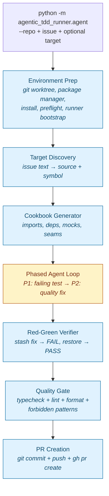
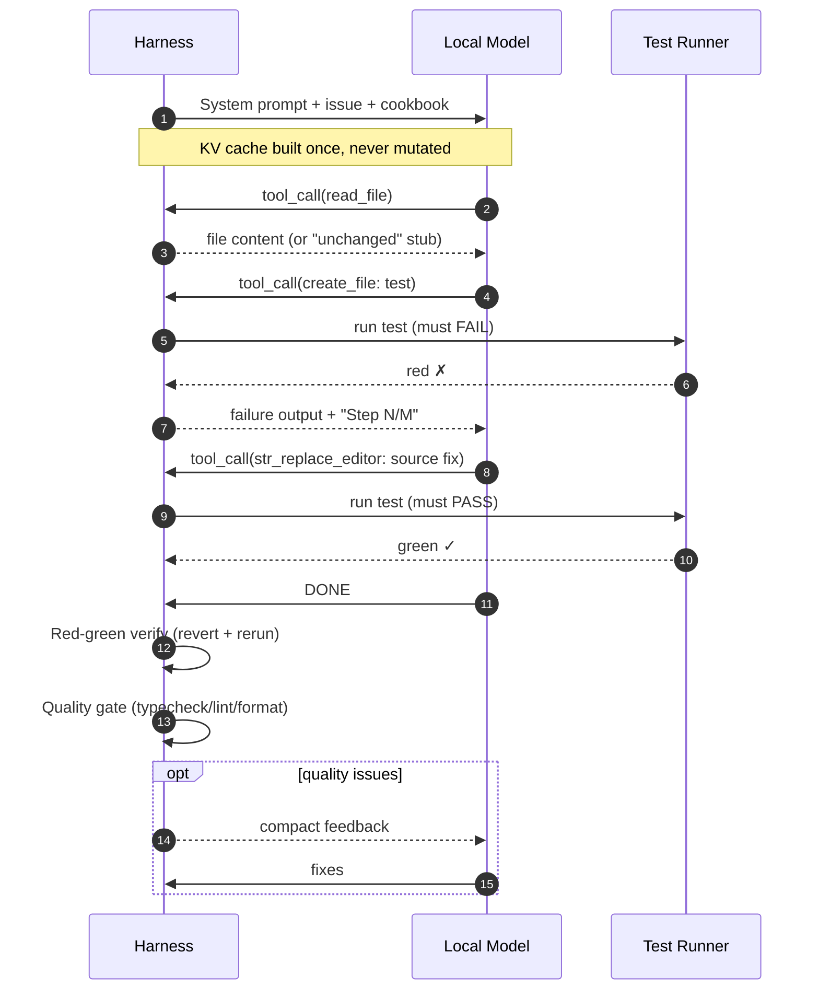
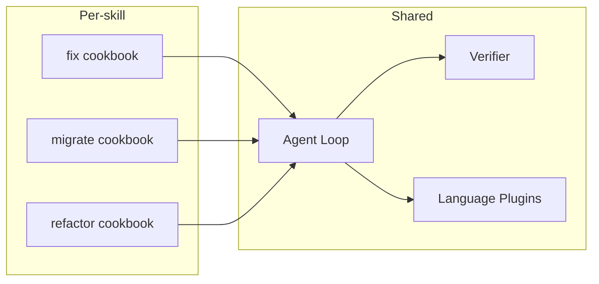

# ATM — Agentic Team Member

> Point a local LLM at a bug. Get back a fix with tests, a verified red-green, and a PR.

[](#status)
[](#requirements)
[](#status)
[](#license)

ATM is a small Python harness that turns a local code model (Qwen 3.5 27B / 4B on
[llama-server](https://github.com/ggml-org/llama.cpp) or [Ollama](https://ollama.ai))
into a **TDD bug-fix agent** for your repository. No API keys. No data leaves the box.

It does the work a junior engineer would do on a single, well-scoped issue: read
the code, write a failing test, fix the bug, verify red-green, and open a PR.

---

## Table of contents

- [Why local-first](#why-local-first)
- [Quick look](#quick-look)
- [How it works](#how-it-works)
- [The cookbook](#the-cookbook)
- [Skills](#skills)
- [Language plugins](#language-plugins)
- [Architecture deep dive](#architecture-deep-dive)
- [Benchmark](#benchmark)
- [Configuration](#configuration)
- [Installation](#installation)
- [Usage](#usage)
- [Road to OSS](#road-to-oss)
- [Contributing](#contributing)
- [Status](#status)
- [License](#license)

---

## Why local-first

Most coding agents assume a frontier model behind a paid API. ATM assumes the
opposite: a 4B–27B model running on your laptop or workstation, with a 32k
context window and no network egress.

That constraint shaped every design decision:

- **The cookbook does the thinking the model can't.** Local models can write
  code, but they get lost in dependency graphs. ATM parses imports, traces
  factory calls, classifies module-level mutables, and hands the model a ready
  mock recipe before the first turn.
- **Phased prompting beats clever planning.** Two short, focused phases
  (test-first, then quality-fix) outperform open-ended ReAct loops on a small
  model.
- **KV cache is a budget.** The system prompt is built once and never mutated.
  File reads are deduped by `st_mtime_ns`. Compaction only fires above 85% of
  the context window. A 27B model reaches green in 4 steps because we never
  burn its attention on re-reading the same file.

---

## Quick look

```bash
# 1. Start a local model server
llama-server \
  --model Qwen3.5-27B.Q4_K_M.gguf \
  --host 127.0.0.1 --port 11435 \
  --ctx-size 32768 --n-gpu-layers 999 \
  --jinja --no-webui

# 2. Point ATM at a GitHub issue
python3.12 -m agentic_tdd_runner.agent \
  --repo /path/to/your/repo \
  --github-repo your-org/your-repo \
  --issue-number 41
```

ATM clones a detached worktree under `your-repo/.worktree/`, runs environment
prep, generates a cookbook for the target function, then drives the model
through a two-phase TDD loop. If everything goes green, it commits and opens a
PR via `gh`.

---

## How it works



Blue blocks are deterministic Python. The single yellow block is where the
local model runs. Putting as much as possible into deterministic blocks is the
whole game — every step that doesn't need an LLM is one less round-trip, one
less chance for the model to drift, and one less cache miss.

### Inside the agent loop



The harness never asks the model to plan, summarize, or reflect. Every turn is
either a tool call or `DONE`. The model is fast because we ask it to do one
small thing at a time.

---

## The cookbook

Local models (4B–27B) can fix source code but cannot resolve complex mocking
graphs. Without help, a 27B will spend 15+ steps figuring out what to mock,
often getting stuck in loops. The cookbook is the semantic prep that closes
that gap.

| Cookbook output       | What it solves                                                                                  |
| --------------------- | ----------------------------------------------------------------------------------------------- |
| Import map            | Resolves `from x import y` and `import { y } from "x"` across TS/Python                         |
| Dependency graph      | Factory results (`const log = getLogger()`) vs singletons vs mutable locals (`let client`)      |
| Mock recipes          | `mock.module()` for imports, setter injection for module-level mutables                         |
| Module-level factories | Includes deps that execute on import even if the target function doesn't use them directly     |
| Assertion ranking     | Outbound calls scored (`say` > `emit` > `info` > `get`); calls on parameters skipped           |
| Class vs function     | Detects methods vs top-level functions; emits correct import + instantiation in the scaffold    |
| Test scaffold         | A ready-to-fill test file with imports, mocks, seams, and a single `it()` block                 |

Everything in the cookbook is deterministic Python — no LLM is involved in its
generation. The model only sees the result.

---

## Skills

ATM is one agent with multiple skills. Each skill is a different cookbook —
the agent loop, verifier, and language plugins are shared. Teaching ATM a new
skill means writing a new cookbook, not a new agent.



| Skill      | Status     | What it does                                                                          |
| ---------- | ---------- | ------------------------------------------------------------------------------------- |
| `fix`      | ✅ shipped | Analyze a bug, write a failing test, fix the source, verify red-green, open a PR      |
| `migrate`  | 🛠 planned | Read a dependency upgrade guide, extract rules, apply file-by-file with verification  |
| `refactor` | 🛠 planned | Large-scale codemods guided by rules — an agent that understands the code, not regex  |

### Why `migrate` matters

Dependabot opens a PR bumping a dependency from v3 to v4, but it doesn't fix
the breaking changes. You read the migration guide, understand what broke, and
fix it file by file. Renovate doesn't fix this either. No tool in the
ecosystem closes this gap today — and a local-first agent with a cookbook
that ingests the upgrade guide is exactly the right shape for it.

### The skill pattern

Every skill follows the same three-step architecture:

1. **Cookbook** (deterministic) — analyze the problem, generate an artefact
2. **Agent** (LLM) — execute the plan with tools
3. **Verifier** (deterministic) — confirm the work is correct

What changes between skills is step 1. The cookbook is the semantic layer —
it's what turns a generic model into a specialist.

---

## Language plugins

Languages are plugins. Adding a new language requires zero changes to existing
code — drop a module in `agentic_tdd_runner/languages/` and implement nine
hooks:

```text
agentic_tdd_runner/languages/
  __init__.py
  typescript.py   # TS/JS: bun:test/jest/vitest, mock.module(), export detection
  python.py       # Python: pytest, unittest.mock, class method support
  signature.py    # Shared helpers for parsing parameter lists
  # go.py         # Future: go test, interfaces
```

Each plugin implements: `parse_imports`, `parse_assignments`,
`parse_signature_params`, `test_path`, `setter_name`, `is_exported`,
`import_path`, `render_seam_setter`, `prepend_export`.

---

## Architecture deep dive

The agent loop is a harness around a local LLM. Every design decision
optimizes for fewer steps and higher KV cache hit rates.

### Phased prompting

The agent runs in two phases with distinct prompts:

1. **Phase 1 (test-first)** — the model receives the bug description, the
   cookbook output (mocks, seams, assertion hints), and a prompt that says
   "write a failing test, then fix the source." This eliminates source-first
   drift; the model goes straight to TDD.
2. **Phase 2 (quality fix)** — after red-green verification, quality issues
   (`: any`, missing types, lint) are fed back. The model fixes only what's
   listed.

A step-counter nudge (`Step N/M`) is appended as the last user message on each
turn. The placement is deliberate — appending at the tail preserves the KV
cache prefix for every preceding message.

### Context management

The system prompt is built once before the loop and never mutated. This makes
it byte-identical across turns, so llama-server reuses 100% of the KV cache
for the system prompt on every step.

After a quality failure, the runner decides whether to compact based on actual
token usage:

- **Below 85% of context window** — preserve all messages, append quality
  feedback. The model keeps full context and doesn't re-read files.
- **Above 85%** — compact to three messages (system prompt, issue, quality
  feedback) as a safety net.

In practice, most runs never compact. The handleResub benchmark uses ~9k of
32k tokens at the quality boundary; compacting there destroyed useful context
and added 2–3 steps of re-reading.

### File read dedup

The runner tracks the last `st_mtime_ns` seen for every `read_file` path. If
the model re-reads an unchanged file, it gets a stub: *"File unchanged since
last read. Refer to the earlier content."*

The cache is invalidated when `str_replace_editor` or `create_file` modifies
the file (explicit `pop`) and cleared entirely on compaction (the model loses
the original tool result, so the cache must reset).

### Reactive feedback

After every `str_replace_editor` or `create_file`, the runner runs the
project's typecheck and feeds errors back inline in the tool result. The model
sees the tsc error immediately, not on the next test run. This cuts a full
round-trip per type error.

### TypeScript pill

An optional ~250-token block of standard TypeScript handbook material in the
system prompt:

- How to read structured tsc errors (the target type appears in continuation
  lines)
- Type narrowing techniques (`typeof`, truthiness, equality, `in`, `String()`)
- Type import syntax (`import type { T }`)

This isn't model-specific instruction — it's reference material. It reduces
quality-phase steps by teaching the model to read tsc output instead of
searching for types.

---

## Benchmark

Same bug (handleResub cumulative months), same issue text, clean worktree each
run.

### Current results (phased runner + quality gate)

| Run | Config         | Thinking | Green | Done | Notes                                       |
| --- | -------------- | -------- | ----- | ---- | ------------------------------------------- |
| r32 | base           | on       | 4     | 15   | baseline with quality gate                  |
| r34 | pill, 4B       | on       | 5     | 21   | 4B model, TypeScript pill validated         |
| r36 | pill           | on       | 4     | 11   | best pre-optimization                       |
| r38 | base           | off      | ~5    | 19   | `thinking_budget_tokens=0`                  |
| r39 | pill+nothink   | off      | 7     | 16   | pill compensates for no thinking            |
| r41 | pill+think     | on       | 4     | **10** | threshold compact + read dedup            |

*Green* = step where the test passes. *Done* = total steps including quality
fixes and PR.

### Key findings

- **27B is deterministic** — green at step 4 in every 27B run. Variance is
  only in the quality phase.
- **TypeScript pill matters** — ~250 tokens of TS handbook reference
  (narrowing, reading tsc errors, type imports) reduces quality-phase steps
  significantly.
- **Thinking matters in the quality phase** — the model uses extended
  reasoning to resolve type narrowing (`string | true` → `String()`). Without
  thinking, it takes more steps.
- **Context preservation beats compaction** — compacting at 9k/32k (28%
  usage) destroyed useful context and forced re-reads. Threshold-based
  compaction (85%) preserves context when there's headroom.
- **File read dedup pays for itself** — `st_mtime_ns`-keyed cache avoids
  re-reading unchanged files. Invalidated on edit/write, cleared on
  compaction.

### Earlier results (pre-phased runner)

| Run | Model         | Steps | Result    |
| --- | ------------- | ----- | --------- |
| R1  | 27B distilled | 23    | VERIFIED  |
| R2  | 27B distilled | 18    | VERIFIED  |
| R3  | 27B base      | 15    | VERIFIED  |
| R4  | 4B            | 44+   | FAIL      |

Without the cookbook, the 27B ran 33+ steps (~90 min) and never finished.

---

## Configuration

Per-run configuration in TOML. Multiple presets live in `config/` for
different models and strategies (`agent.toml`, `agent-r33-4b.toml`,
`agent-r39-27b-pill-nothink.toml`, etc.).

```toml
[agent]
max_steps = 50
max_tool_output = 8000
non_apply_step_warning_threshold = 5

[llm]
url = "http://127.0.0.1:11435/v1/chat/completions"
model = "qwen3.5-27b"
temperature = 0.6
top_p = 0.95
top_k = 20
# thinking_budget_tokens = 0   # optional: disable thinking per-request

[timeouts]
tool_execution = 60
llm_request = 600
test_run = 30
pr_create = 120

[runner]
command = "bun test"
framework = "bun:test"
test_file_patterns = ["*.test.ts", "*.test.tsx", "*.test.js", "*.test.jsx", "test_*.py"]
exclude_dirs = ["node_modules"]

[environment]
enabled = true
install = "auto"          # auto | always | never
require_clean = true
run_typecheck = true
timeout = 300

[discovery]
enabled = true

[quality]
enabled = true
max_fix_rounds = 3

[quality.typescript]
forbidden = ["as any", "as unknown as", "as never", "{} as", ": any", "eslint-disable", "@ts-ignore", "@ts-expect-error"]

[quality.python]
forbidden = ["type: ignore", "noqa"]

[pr]
enabled = true
base_branch = "main"
branch_prefix = "atm/fix-"

[tools]
file = "tools.json"
recommended = ["rg"]
```

The `[prompt]` and `[verification]` sections (system prompt template, max
rejection rounds) are also configurable — see `config/agent.toml` for the full
reference.

---

## Installation

```bash
git clone https://github.com/thellmwhisperer/agentic-team-member.git
cd agentic-team-member
pip install requests
```

There's no published package yet — clone and run from source.

---

## Requirements

- Python 3.12+
- [`requests`](https://pypi.org/project/requests/)
- A local LLM server — [llama-server](https://github.com/ggml-org/llama.cpp)
  or [Ollama](https://ollama.ai)
- A GGUF model with tool-calling support (tested with Qwen 3.5 27B and 4B)
- [`gh`](https://cli.github.com/) CLI for PR creation
- [`rg`](https://github.com/BurntSushi/ripgrep) recommended for the agent's
  search tool

---

## Usage

### Start the model server

```bash
llama-server \
  --model Qwen3.5-27B.Q4_K_M.gguf \
  --host 127.0.0.1 --port 11435 \
  --ctx-size 32768 --n-gpu-layers 999 \
  --jinja --no-webui
```

Don't pass `--reasoning-budget` to the server — ATM controls it per-request
via `thinking_budget_tokens` in the config.

### Run the agent

```bash
# Option A: pass an inline issue or a file path
python3.12 -m agentic_tdd_runner.agent \
  --repo /path/to/repo \
  /path/to/issue.md

# Option B: fetch a GitHub issue by number
python3.12 -m agentic_tdd_runner.agent \
  --repo /path/to/repo \
  --github-repo owner/repo \
  --issue-number 41
```

When `--repo` is supplied, ATM creates a detached run worktree under
`REPO/.worktree/` by default, then runs environment prep there. That keeps all
run filesystem access inside the target project. Pass `--run-root` to override
the worktree location, or `--source` + `--symbol` to pin the target (skip
discovery).

### CLI reference

| Flag                | Description                                                       |
| ------------------- | ----------------------------------------------------------------- |
| `issue` (positional) | Issue text, or path to a file containing the issue description    |
| `--issue-number`    | GitHub issue number to load from the target repo                  |
| `--github-repo`     | GitHub repo slug for `--issue-number`, e.g. `owner/repo`          |
| `--repo`            | Existing git repo to materialize into an isolated run worktree    |
| `--base-ref`        | Git ref used when creating a run worktree (default `main`)        |
| `--run-root`        | Directory for generated run worktrees (default `REPO/.worktree`)  |
| `--source`          | Source file path relative to workdir (e.g. `src/twitch/client.ts`) |
| `--symbol`          | Target function/method name (e.g. `handleResub`)                  |
| `--workdir`         | Project root, or destination when `--repo` is used                |
| `--config`          | Path to agent.toml config file                                    |
| `--log-dir`         | Directory for JSONL logs (default `cwd`)                          |

### Environment variables

Runtime defaults can come from `.env` in the current directory:

```bash
AGENT_LLM_URL=http://127.0.0.1:11435/v1/chat/completions
AGENT_MODEL=qwen3.5-27b
# AGENT_WORKDIR=/path/to/project
AGENT_MAX_STEPS=50
AGENT_MAX_TOOL_OUTPUT=8000
# AGENT_LOG_DIR=/tmp/agent-logs
```

---

## Road to OSS

Things the project is moving toward before it can call itself production-grade:

1. **Modular runner** — `agent.py` is being split into cohesive modules
   (environment prep, runner bootstrap, target discovery, agent loop). See
   merged PRs
   [#38](https://github.com/thellmwhisperer/agentic-team-member/pull/38) and
   [#39](https://github.com/thellmwhisperer/agentic-team-member/pull/39).
2. **A real package** — `pyproject.toml`, an installable `atm` CLI entry
   point, and a published version on PyPI.
3. **Generalized discovery** — the discovery heuristics still carry vestiges
   of the original Twitch-bot exercise; they need to be generalized or
   renamed.
4. **More language plugins** — Go and Rust are the obvious next targets.
5. **The `migrate` and `refactor` skills** — both have a clear design but
   no implementation yet.
6. **A LICENSE file** — the README says MIT; the repo needs the actual
   `LICENSE`.

---

## Contributing

The codebase is small enough to read in an afternoon. The high-leverage areas
are:

- **Language plugins** — add a new language by implementing nine hooks in
  `agentic_tdd_runner/languages/`. No changes to the core loop required.
- **Cookbook heuristics** — assertion ranking, dependency classification,
  and seam detection all live in `agentic_tdd_runner/compiler/`. Bug reports
  with a reproducible fixture are especially welcome.
- **New skills** — a new cookbook turns ATM into a different agent. The
  `migrate` skill is the most-wanted next one.

Run the tests:

```bash
python -m pytest
```

Benchmarks for the phased runner live in `bench/` and are runnable
end-to-end against a local model.

---

## Status

Alpha. The TDD `fix` skill works end-to-end on the benchmark and on real
issues in the Twitch-bot reference repo: cookbook → phased agent loop →
verified red-green → quality gate → PR. The `migrate` and `refactor` skills
are designed but not implemented.

The runner is being modularized; expect the public API surface (CLI flags,
config schema) to shift before 1.0.

---

## License

MIT. A `LICENSE` file is on the [Road to OSS](#road-to-oss) list — until it
lands, treat the repo as MIT-intent.
