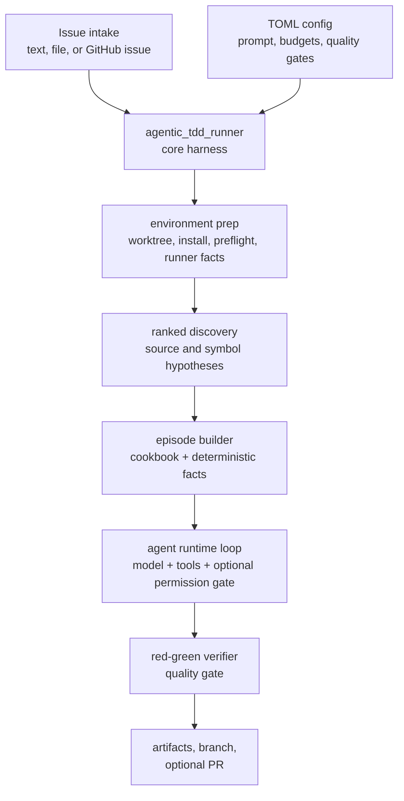

# ATM Architecture

ATM has one canonical harness, `agentic_tdd_runner`, and multiple execution
targets. The harness owns the product behavior. Targets own the environment
around it.



## Core Responsibilities

The core harness owns:

- issue intake and GitHub issue loading
- isolated worktree creation for target repositories
- environment preparation and runner detection
- ranked source/symbol discovery
- cookbook generation and model-facing task context
- tool execution inside the run worktree
- optional permission-driven `ask_harness` gating and target challenge/reroute
- intent routing and state review
- red-green verification
- quality checks and rejection loops
- artifact export, git commit, push, and PR creation

The core must stay target-agnostic. It must not import AWS, CDK, boto3,
AgentCore, CloudWatch, Roca, or local model supervisor code.

## Target Responsibilities

Execution targets own:

- how the model endpoint is started or reached
- environment variables and runtime entrypoints
- where logs, worktrees, and caches live
- target-local config rendering
- cloud infrastructure and secrets
- packaging and smoke tests for that environment

Targets invoke the harness with:

```bash
python -m agentic_tdd_runner.agent
```

## Target Shapes

The local target runs the harness on a developer machine and calls a local
OpenAI-compatible endpoint, usually `llama-server`.

The AWS AgentCore target hosts the harness in an AgentCore Runtime container,
uses an in-container OpenAI-compatible proxy to call Bedrock Converse, and
optionally reads/writes durable memory through Roca Cloud MCP.

The two targets share the same harness lifecycle, but they are not the same
runtime path. Their operational diagrams live in:

- [`../targets/local/README.md`](../targets/local/README.md)
- [`../targets/aws-agentcore/README.md`](../targets/aws-agentcore/README.md)


## Boundaries

Versioned core config belongs under `config/`. Personal machine settings belong
in `.env.local` or `*.local.toml`. Cloud credentials and tokens belong in a
secret manager or local shell environment, never in committed files.

Generated worktrees, logs, synthesized CDK output, and runtime caches should
stay under ignored directories such as `.atm/` or target-local temp paths.
