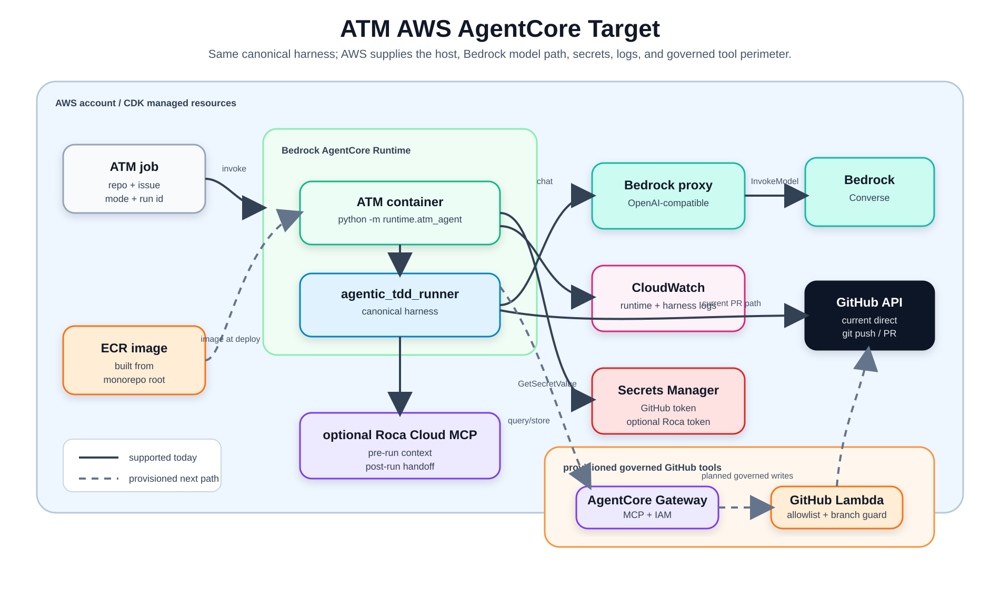
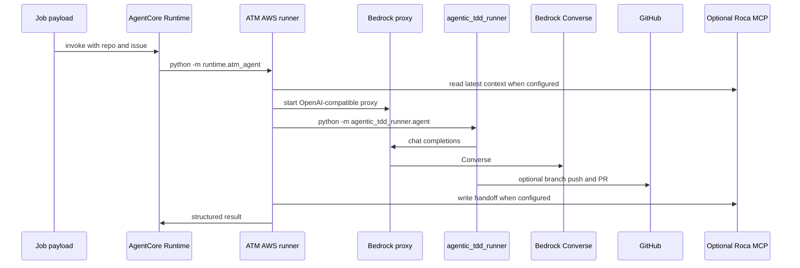

# AWS AgentCore Target

The AWS AgentCore target is an optional deployment adapter for ATM. It is not a
separate product and it does not carry a forked harness. The runtime image is
built from the monorepo root and includes the canonical `agentic_tdd_runner`
package.



## What Changes From Local

| Concern | Local target | AWS AgentCore target |
| --- | --- | --- |
| Host | Developer machine | Bedrock AgentCore Runtime |
| Model | Local OpenAI-compatible endpoint | In-container proxy to Bedrock Converse |
| Worktree | Local filesystem under `.atm/` | Container cache under `/tmp/atm-agentcore` |
| Logs | JSONL files under `.atm/logs` | Runtime output and harness logs in CloudWatch |
| Secrets | Local tools and env vars | Secrets Manager references and runtime env |
| Memory | None by default | Optional Roca Cloud MCP |
| GitHub writes | Harness git/`gh` flow | Direct runtime flow today; Gateway is the governed migration path |

## Runtime Path



## CDK

The CDK app lives under `targets/aws-agentcore/infrastructure/`. It synthesizes:

- an AgentCore Runtime using the Docker image asset
- a runtime IAM role
- a Lambda-backed AgentCore Gateway target for GitHub tools
- Secrets Manager references for GitHub and optional Roca tokens
- CloudWatch log settings
- stack outputs for runtime and Gateway identifiers

Synthesize only:

```bash
make -C targets/aws-agentcore cdk-synth
```

The repo intentionally does not include a deploy command. Deployment should be
an explicit operator action after context values and synthesized IAM are
reviewed.

## Required Deployment Inputs

- AWS profile via `AWS_PROFILE`
- AWS region via `CDK_DEFAULT_REGION`, `AWS_REGION`, or `AWS_DEFAULT_REGION`
- stack name via `ATM_AGENTCORE_STACK_NAME` or CDK context
- Bedrock model id via `ATM_BEDROCK_MODEL_ID` or CDK context
- GitHub token secret name via `GITHUB_TOKEN_SECRET_NAME` or CDK context
- repo allowlist via `GITHUB_REPO_ALLOWLIST` or CDK context

Optional:

- `ROCA_CLOUD_MCP_URL`
- `ROCA_TOKEN_SECRET_NAME`
- `ATM_BRANCH_PREFIX`
- `ATM_AGENTCORE_RUNTIME_NAME`
- `ATM_AGENTCORE_GATEWAY_NAME`
- `ATM_PERMISSION_DRIVEN`

## Gateway Status

The Gateway/Lambda path is provisioned as a narrow perimeter for GitHub tools:
read issue, create branch, commit files, open PR, and comment on an issue.
Write calls enforce repo allowlist and branch prefix.

Today the runtime can still pass a GitHub token to the harness so the canonical
PR flow works unchanged. Moving all writes behind Gateway tools is a later
migration step.

## Local Validation

These commands do not deploy AWS resources:

```bash
make -C targets/aws-agentcore test
make -C targets/aws-agentcore smoke
make -C targets/aws-agentcore docker-build
make -C targets/aws-agentcore docker-smoke
make -C targets/aws-agentcore cdk-synth
```

The target tests cover job parsing, runner command construction, optional
memory behavior, secret loading, Bedrock proxy translation, Gateway validation,
packaging, and CDK scaffold expectations.
