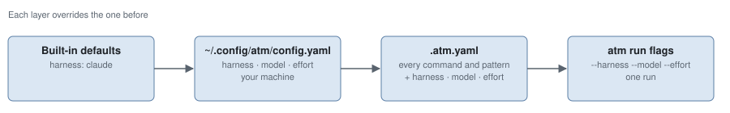

# Configuration

This page is everything you set: the two YAML files, the flags of `atm run`,
the issue it takes and the commands that go with it. What a run then does
with them is in [How a run flows](how-a-run-flows.md).

<picture>
  <source media="(prefers-color-scheme: dark)" srcset="assets/config-layers-dark.svg">
  
</picture>

## Layers

Each layer overrides the one before. A key no layer knows fails the run.

| Layer | Where | Sets |
|-------|-------|------|
| Built-in defaults | the binary | `harness: claude` |
| Your machine | `~/.config/atm/config.yaml` | `harness`, `model`, `effort` only |
| The repository | `.atm.yaml` at its root | every key below |
| One run | `atm run` flags | `--harness`, `--model`, `--effort` |

## `~/.config/atm/config.yaml`

Optional. It says which agent you run everywhere.

| Key | Meaning |
|-----|---------|
| `harness` | The coding agent CLI: `claude`, `codex`, `opencode` or `pi` (local models go through `pi`). Any other fails the run |
| `model` | Its model; empty is the CLI's default |
| `effort` | Its effort; empty is the CLI's default |

```yaml
harness: claude
model: claude-opus-5-5
effort: high
```

## `.atm.yaml`

The repository declares every command a run needs. ATM detects nothing and
defaults nothing per language. Every key below is required: an empty value is
a deliberate "none", a missing key fails with `config incomplete`. `harness`,
`model` and `effort` may go here too, over your machine's file.

| Key | Meaning |
|-----|---------|
| `install` | Installs dependencies in a fresh clone |
| `test` | Runs the whole test suite |
| `typecheck` | Typechecks |
| `lint` | Lints |
| `test_file` | Runs one test: `{file}` is its path, `{dir}` its directory as `./dir`. When not empty, it must contain one of them |
| `test_patterns` | Globs of the test files |
| `docs_patterns` | Globs of the documentation files |
| `delivery` | Shell line that takes the run's branch from its clone, for example to a PR. Empty skips delivery |

Every command runs with `sh -c`. For a Go repository:

```yaml
install: go mod download
test: go test ./...
typecheck: go vet ./...
lint: golangci-lint run
test_file: go test {dir}
test_patterns: ["**/*_test.go"]
docs_patterns: ["**/*.md", "docs/**"]
delivery: 'no-mistakes axi run --intent "$ATM_ISSUE_TEXT"'
```

The `delivery` line hands the branch to
[no-mistakes](https://github.com/kunchenguid/no-mistakes). Without `--yes` it
only reports: whoever launched the run answers each finding.

## Commands

Run every command from inside the repository it works on.

| Command | Does |
|---------|------|
| `atm init` | Writes a commented `.atm.yaml` with every key empty, unless there is one, and adds `/.atm/` to `.gitignore` unless it is there. Run twice, it changes nothing |
| `atm doctor` | Checks git, the configured agent CLI on `PATH`, `gh` when `origin` is on GitHub, and that `.atm.yaml` declares every key. One `ok` or `fail` line each; every check runs, and any failure exits non-zero |
| `atm run [flags] <issue>` | Starts a run. On a terminal it shows the run's screen until it ends and exits with the run's code; off one it prints the run's label and returns |
| `atm status` | Each run going: label, step, duration, issue; or `nothing runs` |
| `atm attach [run]` | The run's screen, the last one going by default, until it ends |
| `atm runs` | Retained runs: label, `running`, `passed` or `failed at <step>`, duration, issue and report |
| `atm axi run [--json] [flags] <issue>` | Waits for the run to end, prints its outcome and exits with its code |
| `atm axi status [--json]`, `atm axi runs [--json]` | The runs going, or retained runs, as a table |

Leaving a screen with `q` or Ctrl-C, or closing the terminal, leaves the run
going. `atm axi` is for programs: it prints TOON, or JSON with `--json`. Its
outcome always carries `outcome`, `run`, `failed_node`, `reason`, `report`
(empty when the run failed before its first step) and `next_step`. Its tables
have `run`, `issue`, `step` and `duration` for `status`, and `run`, `issue`,
`outcome`, `failed_node`, `duration` and `report` for `runs`.

The exit codes are in the [README](../README.md#run-it).

## `atm run` flags

Flags go before or after the issue. A second issue is an error.

| Flag | Default | Meaning |
|------|---------|---------|
| `--base-ref <ref>` | `main` | The ref the run starts from, resolved in the repository |
| `--harness <cli>` | from the layers | `claude`, `codex`, `opencode` or `pi` |
| `--model <model>` | from the layers | The agent's model |
| `--effort <effort>` | from the layers | The agent's effort |
| `--harness-arg <arg>` | none | One argument for the agent CLI, before the brief. Repeatable |
| `--env KEY=VALUE` | none | One variable in the agent's environment. Repeatable |

## The issue

`atm run 300` reads issue 300 with `gh issue view` from the repository
`origin` names. `atm run plans/retry.md` reads a file: its first line is the
title (leading `#` characters dropped), the rest the body.

Either way the body declares its task type on a case-sensitive `Type:` line,
lowercase: `fix` (or `hotfix`), `feature`, `greenfield`, `refactor`, `tests`,
`docs` or `chore`. The type picks the proof the checks ask for; see
[How a run flows](how-a-run-flows.md#what-each-task-type-proves).

```markdown
# Retry the upload on a timeout

Type: fix

An upload that times out is lost. It should be retried once.
```

## What a run leaves on disk

Everything ATM writes lives under `.atm/` in the repository, which `atm init`
ignores.

| Path | Holds | Kept |
|------|-------|------|
| `.atm/runs/<label>/` | `report.json`, the briefs, the agent logs, `follow-ups.json`, `delivery-output.txt` | Always |
| `.atm/clones/atm-run-<timestamp>/` | The run's isolated clone | Removed when the run ends, unless it delivered and its PR is open |
| `.atm/runs.jsonl` | The last state of each retained run, so `atm runs` survives the background process | Every run going and the newest 200 that ended |
| `.atm/atm.sock`, `.atm/atm.lock`, `.atm/serve.log` | The background process | While it runs; the log stays |

A run's label is `<issue name>-<n>`, `n` counting the repository's runs; it is
what `atm runs` shows. A run that delivered leaves `<clone>.delivered` with its
branch and base. Each new run first removes the clones of runs that are gone,
except a delivered one whose branch is not merged into its base and whose PR
`gh` does not report closed or merged. A clone a live process still uses is
left in place.
