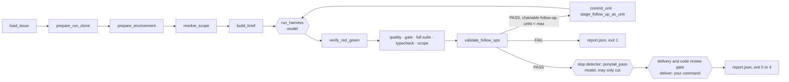

# How a run flows

One run, one issue, from the issue text to your delivery command. Every step
names the function that implements it in `agentic_tdd_runner/harness_worker.py`
unless another module is given. Steps marked **model** call a model; every
other step is deterministic Python and git.

## Live steps and the monitor

Every step below is a named step: the worker writes a start and an end event
for it to `worker-<timestamp>.jsonl` and renders it on its own stdout with the
renderer in `scripts/tail-run.py`: `▶ <step>` when it starts, `✓` or
`✗ <step> <duration>` when it ends. A step with no visible output for 30 s
gets an elapsed line (`… full suite 1m30s`), every 30 s while it stays quiet.

The step names are `prepare`, `agent unit <n>`, `red half`, `green half`,
`quality`, `forbidden scan`, `gate`, `full suite`, `typecheck`, `scope`,
`follow-up validation`, `commit`, `ponytail snapshot`, `ponytail agent`,
`ponytail re-checks`, `delivery` and `clone sweep`. A step with no command (no typecheck,
say) does not run and writes nothing.

`[monitor].command` is a shell line ATM runs at every step start and end, with
`ATM_LABEL`, `ATM_STEP`, `ATM_STATE` (`started`, `passed`, `failed`),
`ATM_DURATION` and `ATM_REPORT` in its environment. Its output is discarded,
its exit code ignored, and it is cut after 5 s. A launcher binds itself to the
run with it: a pane status, a notification, a script that wakes the agent that
launched the run. With no monitor and no terminal on stdout, the worker exits 2
before doing anything: a run nobody can watch is not launched.

## 1. Load the issue

`load_issue` reads `--issue-file` (first line is the title, a leading `#` is
dropped) or runs `gh issue view <n> --repo <owner/repo> --json title,body`.
When the issue came from GitHub, its number is kept so the unit commit can
end with `Closes #<n>`.

## 2. Isolated clone

`environment.prepare_run_clone` resolves the base ref (default `main`) to a
SHA in the source repo, so `origin/main` means what it means there. Then
`git clone --local --no-checkout`, fetch that SHA, check it out detached. The
clone goes to `<repo>/.worktree/atm-run-<timestamp>`, or under `--run-root`; the
directory is claimed with `os.mkdir`, so two runs started in the same second
cannot share one. `/.atm/` is appended to the clone's `.git/info/exclude`.

A full clone and not a git worktree: worktrees share the stash stack, and two
concurrent runs once swapped their work through it.

## 3. Environment prep

`environment.prepare_environment`:

1. `runner_bootstrap.inspect_runner_bootstrap` reads `package.json` and the
   lockfile to name the package manager and the test runner, following
   `scripts.test` through `cross-env`, `npx`, `<pm> run` and script references.
   If both jest and vitest are dependencies and the script does not decide, the
   result is `ambiguous` and no runner is guessed.
2. The clone must be a git checkout and, with `environment.require_clean`,
   clean.
3. JavaScript: install with a frozen lockfile (`npm ci`, `pnpm install
   --frozen-lockfile`, and so on) unless dependencies are already there, write
   `.atm-jest.config.cjs` when a Next.js Jest config needs a shim, then run the
   runner's `--version` and the typecheck as a preflight. A base that does not
   typecheck fails here, before any model call.
4. Python: skipped, with the reason recorded. Anything else, Go included:
   skipped.

Clone, install, preflight, full suite, typecheck and delivery run with
`shell.build_command_env`: the caller's `PATH` plus the usual tool
directories and `[tooling].path_dirs`. All but delivery also get `CI=1`. The
red/green runs and the quality tools inherit the worker's environment as is.

## 4. Scope

`resolve_scope`: `--scope` globs win. Otherwise `derive_scope` collects tracked
paths the issue text names and, for every identifier the issue puts in
backticks, the files that define it (`git grep` for Go `func`, JS/TS
`function` and `const`, Python `def`). An issue that names nothing gives an
open scope. Test files are always allowed.

## 5. Contract

`build_brief` writes `brief.md`. Its sections are the contract:

- **GOAL**: the issue, verbatim.
- **SCOPE**: the clone path, the allowed paths, and the rule that work outside
  them goes to a follow-up with a red test instead of being done.
- **ACCEPTANCE**: a failing test that calls the code path the issue describes
  (not only a new helper), then the fix, then the test passes, the full suite
  passes, typecheck passes.
- **VERIFY**: the exact test and typecheck commands.
- **STYLE: ponytail**: the condensed ponytail rules.
- **FORBIDDEN**: the language's forbidden patterns on added lines; `git
  commit`, `git push`, `git rebase`, any `gh` command; deleting, skipping or
  weakening tests; `sleep` in tests.
- **FOLLOW-UPS**: the pair rule (test on disk under `.atm/follow-ups/<n>/` and
  an entry in the report) and the criterion rule.
- **REPORT**: the JSON object the final message must be, and nothing else.

## 6. Coding agent (model)

`harness_command` builds the CLI call:

| Harness | Command |
|---------|---------|
| `claude` | `claude -p --output-format stream-json --permission-mode acceptEdits --allowedTools Read Edit Write Bash Glob Grep` |
| `codex` | `codex exec --json -C <clone> --sandbox workspace-write --output-schema <schema>` |
| `opencode` | `opencode run --pure --format json --dir <clone>` |
| `pi` | `pi -p --mode json --no-extensions --no-skills --no-prompt-templates --no-context-files --no-session` |

`--model` and `--effort` pass through (Codex gets `model_reasoning_effort`,
pi gets `--thinking`). `--harness-arg` adds arguments before the brief and
`--env` adds environment variables. `CLAUDE_CODE_CHILD_SESSION` is removed so
a nested Claude Code session keeps its transcripts.

`run_harness` starts the CLI in its own process group with a timer
(`--timeout`, default 1800 s); on timeout the whole group is killed. Every JSON
line of the stream goes to the log and the terminal. `extract_report` takes the
last top-level JSON object of the final message.

## 7. Red / green

`verification.verify_red_green`, wrapped by the worker's `red_green`:

1. `worktree_fingerprint` hashes every path that differs from HEAD.
2. Back up the test file, then `snapshot_worktree`: `git add -A`, `git stash
   create` (a dangling commit, never on `refs/stash`), `git reset --hard HEAD`.
3. Copy the test back in and run it alone with `single_test_argv`. It must
   fail.
4. `restore_worktree`: `git stash apply --index`, `git reset -q`.
5. Run the test again. It must pass.
6. If the fingerprint changed, the verdict is void. If the red output is a
   real import error (`ModuleNotFoundError`, `Cannot find module`, `Failed to
   resolve import`), `red_failed_on_missing_module` rejects it as an INVALID
   RED: a test that fails because the fix's new file is absent proves nothing
   about the bug. Pytest's captured-output sections are ignored for this.

Python test files always run with `python3 -m pytest`; JavaScript and
TypeScript with the detected runner; anything else with `[runner].command`,
where `{test_file}` and `{test_dir}` are substituted. Each run is bounded by
`[timeouts].test_run`.

## 8. Quality

`quality.run_quality_checks`. The language is the test file's: only changed
files of that language are checked.

- `languages.detect_quality_tools`: for Python, ruff check and format when
  `pyproject.toml` has `[tool.ruff]`; for TypeScript, the `typecheck` script or
  `tsc --noEmit`, then biome, or eslint and prettier. Each tool's `fix` runs
  first, then its check, so the clone may change here.
- Forbidden patterns on lines added since the unit's base (`git diff -U0`), so
  patterns already in the base do not fail a unit.
- Detectors: `__set*ForTests` exports in production code, tests that read
  source files and assert on their text, changed keys in log/track/emit
  payloads, metadata parsing without the original as fallback, `{} as Type`,
  and duplicated test lines. Ambiguous duplicates go to the optional Ollama
  judge; if Ollama does not answer, they pass.
- Go has no quality tools; `scan_forbidden` applies `[quality.go].forbidden`.

## 9. Gate, suite, typecheck, scope

- `check_gate`: HEAD is still the unit's base (the agent made no commits), and
  the diff touches at least one non-test file.
- `full suite` and `typecheck`: `detect_commands` gives `<pm> run test` and
  the typecheck script for JavaScript, `python3 -m pytest` for Python, `go test
  ./...` and `go vet ./...` when there is a `go.mod`. Bounded by
  `[environment].timeout`. On failure the last 60 lines go into the unit
  record.
- `check_scope`: every touched non-test file outside `.atm/` matches a scope
  glob.

## 10. Follow-ups

`validate_follow_ups` reads the report's `follow_ups` and the tests on disk
under `.atm/follow-ups/<n>/`. A test on disk without a declaration is still
judged: the test is the evidence. For each one:

- `follow_up_verdict` copies the red test into place, runs it, removes it. It
  must fail on behaviour. `accepted` means it proves a gap.
- `symbols_defined_in_base`: the test must call at least one identifier
  defined in the base commit's production source.
- `criterion_in_issue`: the cited criterion must be a sentence of the issue,
  compared loosely (three quarters of its words of four letters or more).
- `judge.judge_follow_up` (model, optional): Jev scores whether the gap serves
  the issue or widens it. Enabled without a key, it fails closed.

`chainable` is all of them together. An accepted follow-up that is not chained
goes to `follow-ups.json` for a later run.

## 11. Next unit

A unit that passed with a chainable follow-up, below `max_units`, is committed
by `commit_unit` (`atm unit <n>: <title>`, plus `Closes #<n>` for GitHub
issues) so the next red/green runs against it. `stage_follow_up_as_unit` moves
the red test into place and parks this unit's `.atm/follow-ups`.
`build_unit_brief` writes the next contract: make that test pass without
editing it. The loop ends on a failed unit, no chainable follow-up, or
`max_units`.

## 12. Slop detector: the ponytail pass (model, may only cut)

A code quality gate, not a code review: it does not judge whether the fix is
right, the checks already did. It looks for code the fix does not need.

After the checks pass, the ponytail pass reviews the run's diff. A kept cut
leaves a unit commit and a separate ponytail commit. See
[configuration](configuration.md#go-port-configuration) for the current Go
port's cut rules, checks, report, commits and tombstones.

## 13. Delivery and code review gate

With `[delivery].command` empty, delivery is skipped and the work stays in the
clone. Otherwise `deliver`:

1. Creates `atm/<slug>-<timestamp>` in the clone, commits anything left, and
   points the clone's `origin` at the source repo's.
2. Runs the command through the shell in the clone, with `ATM_TITLE`,
   `ATM_ISSUE` (empty with `--issue-file`), `ATM_BRANCH`, `ATM_CLONE`,
   `ATM_REPORT` and `ATM_PONYTAIL` (the kept findings, or empty) in its
   environment. Its output goes to the terminal and to `delivery-output.txt`.
   ATM does not read it.
3. A non-zero exit makes the worker exit 4.

ATM never pushes or opens a PR itself. The shipped example in
`config/agent.toml` hands the branch to no-mistakes, which runs a graph of its
own, part code and part model:

| no-mistakes step | Code | Model |
|------------------|------|-------|
| intent | takes ATM's `--intent` | |
| rebase | rebases onto the base branch | resolves conflicts, after a `fix` answer |
| review | collects the diff | reviews it and reports findings |
| test | runs `commands.test` | judges the test evidence; fixes failures on a fix round |
| document | collects the changed files | updates the docs |
| lint | runs `commands.lint` | fixes it, after a `fix` answer |
| push | pushes with `--force-with-lease` | |
| PR | opens or updates the PR | writes its title and body |
| CI | waits for the checks, re-runs a cancelled one | repairs a failure on a fix round |

Without `--yes`, a finding stops the gate until whoever launched the run
answers it. What its models change lands as `no-mistakes(...)` commits on the
branch.

## 14. Report

`report.json` carries the run-level verdict and every unit's record:
`verified`, `quality_ok`, `gate_ok`, `scope_ok` with their messages,
`full_tests_ok`, `typecheck_ok` and their output tails, follow-ups with
reasons, `ponytail` (`findings`, `net_lines_before`, `net_lines_after`, `kept`,
`reason`, `tombstones`, `commit`), `delivery`, durations and the harness exit
code. The worker then prints a summary and exits 0, 1, 2 or 4.

## What a run leaves on disk

In the artifact directory (`--artifact-dir`, or `[runs].dir` followed by the
label or a timestamp; see [Configuration](configuration.md#runs)):

| File | What it is |
|------|------------|
| `command.txt` | The exact command, to repeat the run |
| `brief.md`, `brief-unit-<n>.md`, `brief-ponytail.md` | The contract each agent call received, verbatim |
| `worker-<timestamp>.jsonl` | Every event: the agent's stream and ATM's own `atm.*` events |
| `report.json` | The verdict |
| `follow-ups.json` | Follow-ups accepted but not chained, for a later run |
| `delivery-output.txt` | What the delivery command printed |
| `atm/` | The clone's `.atm/` contents, copied here before a merged clone is removed; includes parked follow-up tests |

In the target repository: one clone per run under `.worktree/` (or
`--run-root`). The `clone sweep` step runs at startup and after the final
report on the normal completion path. It checks other run directories next
to the artifact directory. If a `report.json` names an existing `atm-run-`
clone whose branch has a merged PR, ATM removes the clone and records the
time as `clone_removed` in that report. It skips reports marked
`delivery.running: true` while delivery is in progress. If copying `.atm/`
fails, ATM leaves the clone for a later sweep. The run directory and its logs
stay.

## Languages

| Language | Environment prep | One test file | Full suite | Typecheck | Quality tools | Forbidden patterns |
|----------|------------------|---------------|------------|-----------|---------------|--------------------|
| JavaScript, TypeScript | Frozen-lockfile install with pnpm, yarn, bun or npm; jest, vitest, `bun:test`, `node:test` or a custom script; Jest shim for Next.js | The detected runner | `<pm> run test` | `typecheck` script or `tsc --noEmit` | biome, or eslint and prettier | `as any`, `@ts-ignore`, `eslint-disable` and the rest in `config/agent.toml` |
| Python | None: whatever is installed | `python3 -m pytest <file>` | `python3 -m pytest` | none | ruff, when `[tool.ruff]` is set | `type: ignore`, `noqa` |
| Go | None | `[runner].command`, e.g. `go test {test_dir}` | `go test ./...` | `go vet ./...` | none | `[quality.go].forbidden` |

Any other repository gets red/green (with `[runner].command`), gate and scope,
and no language tooling.
