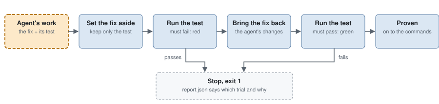

# How a run flows

This page is what `atm run` does with an issue, step by step, and what makes
each step fail. Code decides every step but two: the agent writes the fix and
the slop detector cuts it. What you set before a run is in
[Configuration](configuration.md).

<picture>
  <source media="(prefers-color-scheme: dark)" srcset="assets/red-green-dark.svg">
  
</picture>

## The steps

A failed step stops the run; the steps after it are not run.

| Step | Does | Fails the run when |
|------|------|--------------------|
| Issue | Reads the issue file or GitHub issue and its `Type:` | The issue cannot be read, or has no valid type |
| Clone | Resolves `--base-ref` to a commit, clones the repository there into `.atm/clones/`, runs `install` | The ref, the clone or `install` fails |
| Contract | Writes `brief.md`, the agent's contract | The brief cannot be written |
| Agent | Runs the coding agent in the clone on the brief | It exits non-zero, times out, does not load the `ponytail` skill, or leaves no readable report |
| Checks | Proves the task type, then runs `install`, `test`, `typecheck` and `lint` | A proof or a command fails, or anything committed |
| Slop detector | Lets a model cut the diff; keeps the cut only if every check still passes | Its agent fails, reports badly, or anything commits |
| Delivery | Commits the work on a branch and runs the `delivery` command | The branch or the command fails. Skipped when `delivery` is empty |

Agent and Checks run again for each chained follow-up, at most three units in
one run; see [Follow-ups](#follow-ups).

## Issue, clone and contract

`.atm.yaml` is read before the issue, so a bad configuration fails before
anything else. The clone is detached at the base commit, has `/.atm/` excluded,
and gets its `install` run once. The contract, `brief.md` in the run's
directory, tells the agent to read `AGENTS.md` if there is one, then gives the
issue, the acceptance criteria of its task type, the commands from
`.atm.yaml`, the style, what is forbidden and the JSON report it must end
with.

## Agent

The agent runs in the clone in its most minimal mode:

| Harness | Command | Reads the brief |
|---------|---------|-----------------|
| `claude` | `claude -p --setting-sources project --strict-mcp-config`, tools `Read,Edit,Write,Bash,Glob,Grep,Skill` only | on stdin |
| `codex` | `codex exec`, which still loads your skills | as its last argument |
| `opencode` | `opencode run --pure`, which still loads your skills | as its last argument |
| `pi` | `pi -p --no-extensions --no-skills --no-prompt-templates --no-context-files --no-session` | as its last argument |

ATM writes the bundled `ponytail` skill into the clone, outside git, and the
agent's log must show it loaded under that exact name and succeeded. Every
line the agent writes goes to `worker.jsonl`. Its report is the last JSON
object of its final message and must name `test_file`: ATM never guesses
which test proves the fix. A zero exit without a valid report fails; so does
any non-zero exit.

## Checks

The agent must not have committed. The checks prove the task type, then run
`install` again (the agent may have changed dependencies), `test`, `typecheck`
and `lint`, empty ones skipped. The first failure stops the run with that
command's last 60 lines. A command that commits fails the checks too.

### What each task type proves

| Type | Proof |
|------|-------|
| `fix`, `hotfix` | Red/green on the files the base already has: the files the fix added stay, so the test must fail on behaviour. Then twice more, on the base with only the fix's added lines in place: a test that passes there depends on nothing the base had and is rejected |
| `feature`, `greenfield` | Red/green with everything set aside, so the red may fail on a missing symbol or module |
| `refactor` | `test` passes on the base, and no test file changed |
| `tests` | The new test passes on the base and after; only test and doc files changed |
| `docs` | Only files matching `docs_patterns` changed |
| `chore` | Nothing beyond the commands |

Red/green runs the report's `test_file` alone through `test_file` in
`.atm.yaml`, once with the fix set aside and once with it back. Before each
trial ATM restores the clone to its state before the first, so a trial cannot
leave anything for the next; a test that changes or deletes existing files
voids the verdict, and a test that hangs fails it. Known limit of the `fix`
proof: where added lines cannot run alone, as in a compiled language that
needs the base's declarations, that trial fails and the test passes it.

Every type then fails, naming the old path, when a test file the base has is
deleted or shorter. If Git detects a rename, ATM checks the staged file at its
new path, so moving an unchanged or longer test is allowed.

## Follow-ups

A follow-up is a behaviour gap the agent found and did not fix. Its report
lists each as `{"title", "red_test", "criterion"}`, with the failing test
written at `.atm/follow-ups/<n>/<red_test>`. ATM runs it at `red_test` on the
unit's work: it must fail. One without its test, or whose test passes or
hangs, is rejected. No model judges a follow-up.

An accepted follow-up whose `criterion` is a sentence copied from the issue
becomes the next unit, in the same clone: the unit before is committed as
`atm unit <n>: <title>`, the red test is put in place, and the agent gets
`brief-unit-<n>.md` to make it pass without editing it. The checks prove that
unit red/green as a `feature`. Any other follow-up, and any past the third
unit, goes to `follow-ups.json` in the run's directory, with its test, to
become a new issue.

## Slop detector

Once every unit passed, the same agent gets `brief-ponytail.md`, the issue and
the run's diff, with the bundled `ponytail-review` skill, proven loaded the
same way. It may only cut: delete, shrink, or swap in the standard library or
an existing helper, in the diff's files, keeping every test. Its report is
`{"findings": [{"file", "family", "finding"}], "summary"}`, each `family` a
slopslint family.

ATM snapshots the whole clone first and restores it byte for byte, discarding
the cut, if the cut:

| Discarded when the cut |
|------------------------|
| adds or deletes a file |
| reports no finding, or does not lower the run's net added lines |
| touches a test file, a file outside the diff, or a unit's proven test |
| fails any unit's red/green proof again, or the last unit's checks |

A kept cut is its own commit, `ponytail: <n> cuts`, one line per finding,
after `atm unit <n>: <title>`, with one slopslint tombstone per finding under
`.slop/tombstones/`. Both commits use the repository's git identity; none, or
an email ending in `@localhost`, fails the run.

## Delivery

When `delivery` is set, the clone goes on a new branch
`atm/<title slug>-<timestamp>`, whatever is left uncommitted is committed as
the next `atm unit`, and the clone's `origin` becomes the repository's. Every
commit after the base must carry the repository's git identity. Then the
command runs with `sh -c` in the clone, without a time limit, with these
variables:

| Variable | Value |
|----------|-------|
| `ATM_TITLE` | The issue's title |
| `ATM_ISSUE` | The issue number; empty for a file |
| `ATM_ISSUE_TEXT` | The whole issue, title and body |
| `ATM_BRANCH` | The branch |
| `ATM_CLONE` | The clone's path |
| `ATM_REPORT` | The path of `report.json` |
| `ATM_PONYTAIL` | The kept cut's findings, one a line, or empty |

Its output goes to the screen and to `delivery-output.txt`. ATM never pushes
or opens a pull request: that is the command's business.

## Time limits

| What | Limit |
|------|-------|
| Reading a GitHub issue | 60 s |
| Each command (`install`, `test`, `typecheck`, `lint`, a proof) | 10 min |
| Each agent call, the slop detector's included | 30 min |
| The delivery command | none |

Past its limit, or when ATM gets Ctrl-C or SIGTERM, a process is killed with
every process it started, on Unix and Windows, including those that started a
session or process group of their own and, on Unix, those already orphaned.

## The report

`.atm/runs/<label>/report.json` is rewritten at every step's start and end, so
it is on disk before delivery reads it.

| Field | Holds |
|-------|-------|
| `failed_node`, `reason` | The step that failed and why |
| `nodes` | Each step's `result` (`passed`, `failed`, `running`, `skipped` or `not run`), `started_at` (UTC, RFC 3339 with milliseconds) when it starts, and `duration_ms` when it ends |
| `type` | The task type |
| `units` | Each unit's number, base commit, test file, type, result, red/green proof row span, and red and green trials: command, exit code, last 60 lines, `started_at` and `duration_ms` |
| `reproofs` | The same proof rows and spans, run again after a kept cut |
| `commands` | Every configured command that ran, the clone's `install` included, with its result, last 60 lines, `started_at` and `duration_ms` |
| `head_sha` | The delivered branch's final commit |

## The screen

`atm run` hands the run to the repository's background process, one per
repository, started by the first command that needs it and ended after
10 min without a run. Closing the terminal does not stop the run.

On a terminal the screen is the ATM box, a row per step with its icon (`○`
pending, a spinner running, `⏸` waiting, `✓` passed, `✗` failed, `–` skipped), duration and
note, and beside it, from 100 columns, the Agent box while an agent works,
the Findings box with a failure or the slop detector's cuts, and the Log box.
The Agent box shows the agent's own messages and thinking, and its tool calls
with their results. It omits user messages, skill text, tool results and the
JSON report at the end of the agent's final message.
On Unix, ATM keeps its screen live while the delivery command is silent. From
the command's first output until it ends, ATM gives it the attached terminal
and its keys, so no-mistakes shows its own screen there; ATM's screen comes
back when the command ends.
On Windows, the delivery command runs without ATM's attached terminal, so its
output appears as lines.

Off a terminal, or with `NO_COLOR` or `TERM=dumb`, the screen is plain lines:
one per step start and end, then the delivery's output and the summary. Every
duration ATM prints reads like `0.9 s`, `4 min 28 s` or `1 h 02 min`.
