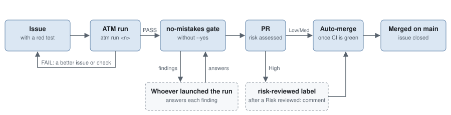

# ATM maintains itself

This page is for whoever maintains ATM itself. A fix to this repository goes
through the same pipeline as a fix to any target: an issue, an ATM run, a
delivery gate, a merge that needs no hand. Here is that loop and what holds
it.

<picture>
  <source media="(prefers-color-scheme: dark)" srcset="assets/self-maintenance-dark.svg">
  
</picture>

## The loop

1. **An issue with a contract.** Title, a `Type: fix` line, evidence,
   acceptance criteria a test can check, and a `## Red test` section naming
   the test that fails today.
   The agent gets exactly this text; a vague issue gives a vague run.
2. **An ATM run.** `atm run <number>` from the repository, its `.atm.yaml`
   filled once with its commands, file patterns and the no-mistakes delivery
   line; see [Configuration](configuration.md).
3. **The verdict.** `report.json`, or the summary at the end of the run. A FAIL
   ends here: the report says which check failed and why, and the issue gets a
   better contract or the code a better check.
4. **The gate.** The green branch goes to `no-mistakes axi run` without `--yes`.
   Review, test, lint and document run as fenced model steps. The reviewer
   only reports (`auto_fix.review: 0`); whoever launched the run answers each
   finding, fixing real defects and dismissing guesses.
5. **The merge.** `auto-merge.yml` arms `gh pr merge --auto --rebase` when the
   PR's `## Risk Assessment` says Low or Medium. High risk waits for a
   `Risk reviewed:` comment and the `risk-reviewed` label. GitHub merges once
   the PR checks pass, closes the issue and deletes the branch.

## What holds the line

| Mechanism | Where | What it does |
|-----------|-------|--------------|
| `go.yml` | GitHub Actions | Change-filtered checks; see [CI](../CONTRIBUTING.md#ci) |
| `auto-merge.yml` + `scripts/arm-auto-merge.sh` | GitHub Actions | Arms auto-merge with `AUTO_MERGE_TOKEN`, a fine-grained token for this repository only. The workflow token is never used: merges made with it start no workflow and close no issue |
| `scripts/test.sh`, `scripts/lint.sh` | local and the gate | Contribution checks; see [Contributing](../CONTRIBUTING.md) |
| `.githooks/pre-commit` | local, after `git config core.hooksPath .githooks` | The same slopslint check |
| `.no-mistakes.yaml` | no-mistakes | Runs the contribution checks, tells the reviewer that only a defect against the issue's criteria or the checks is a finding, and allows one re-run of a CI check GitHub cancelled without a verdict |
| `.slop/config.yml`, `.slop/ceilings.yml` | slopslint | Two duplication scopes, production and tests, under ceilings that may go down and never up |
| `.slop/tombstones/` | slopslint | One record per slop incident, with its family and evidence |

`scripts/slopslint.sh` downloads the pinned slopslint release into
`.tmp/slopslint/`, checks its SHA256 and runs it. The first run needs the
network.

## The tombstones

`.slop/tombstones/` holds one YAML record per incident: the pattern, what went
wrong, the root cause, the rule it set, and the evidence as a slopslint family
with an example and the file. Records named `T-PONYTAIL-*` are written by the
slop detector, one per cut it kept. A tombstone is the shape the gate looks for
next time.

## Before a PR merges

Auto-merge is armed, so this is the last look, and it is short:

1. `git log --oneline origin/main..<branch>`: the `atm unit` commit, a
   `ponytail:` commit if a cut was kept, then the `no-mistakes(...)` commits
   the gate added.
2. `git show --stat` of each gate commit. Review and test are models: a uuid,
   a new loop, a deleted or mock-heavy test, a reformat to another width gets
   reverted on the branch, a tombstone, and another gate run.
3. The run's `report.json`: every check green, follow-ups with their reasons.

