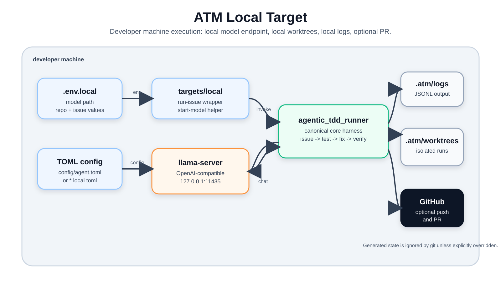

# Local Target

The local target is the canonical open-source way to operate ATM on a developer
machine. It starts or points at a local OpenAI-compatible model endpoint, then
invokes the root harness with explicit worktree and log locations.

This target does not replace the root CLI. It is a thin operational wrapper
around:

```bash
python -m agentic_tdd_runner.agent
```

## Run Shape



The local target owns process startup and local paths. The harness still owns
issue intake, discovery, cookbook generation, the TDD loop, verification,
quality gates, artifacts, and PR creation.

## Files

```text
targets/local/
  .env.example
  Makefile
  scripts/
    start-llama-server.sh
    run-issue.sh
    tail-run.sh
  configs/
    README.md
```

## Setup

Copy the example env file and fill in local-only values:

```bash
cp targets/local/.env.example targets/local/.env.local
```

`targets/local/.env.local` is ignored by git. Put personal model paths, repo
paths, issue numbers, and ports there.

The default local target expects a model endpoint at:

```text
http://127.0.0.1:11435/v1/chat/completions
```

That matches the root `config/agent.toml` default.

## Start A Model

```bash
make -C targets/local start-model
```

This calls `scripts/start-llama-server.sh`, which reads `.env.local` and starts
`llama-server` with the canonical local ATM profile:

```bash
llama-server \
  -hf unsloth/Qwen3.6-27B-MTP-GGUF:UD-Q4_K_XL \
  -a qwen3.6-27b-mtp \
  --host 127.0.0.1 \
  --port 11435 \
  -c 32768 \
  -ngl 99 \
  --jinja \
  --reasoning on \
  --reasoning-budget -1 \
  --parallel 1 \
  --spec-type draft-mtp \
  --spec-draft-n-max 2 \
  --no-webui
```

The binary path remains local. Put your MTP-capable `llama-server` build path in
`ATM_LLAMA_SERVER_BIN` inside `.env.local`. If you use a local GGUF file instead
of a Hugging Face model reference, set `ATM_LLAMA_MODEL_ARG=--model` and
`ATM_LLAMA_MODEL=/path/to/model.gguf`.

This profile disables `llama-server`'s built-in web UI by default. Set
`ATM_LLAMA_NO_WEBUI=false` in `.env.local` to leave the web UI enabled.

For this profile, the harness config should use the same served model alias:

```toml
[llm]
url = "http://127.0.0.1:11435/v1/chat/completions"
model = "qwen3.6-27b-mtp"
```

Keep that in a git-ignored config such as `config/agent.local.toml`, then set
`ATM_CONFIG_PATH=config/agent.local.toml`.

You can also run any OpenAI-compatible server yourself. In that case, keep
`ATM_CONFIG_PATH` pointed at a config whose `[llm].url` and `[llm].model` match
your server.

## Flow

1. `make -C targets/local start-model` starts `llama-server` with values from
   `.env.local`.
2. `make -C targets/local run-issue` loads `.env.local`, resolves the issue
   source, and invokes `python -m agentic_tdd_runner.agent`.
3. The harness creates a run worktree under `ATM_RUN_ROOT`, writes JSONL logs
   under `ATM_LOG_DIR`, and calls the local model endpoint from TOML config.
4. If verification and quality gates pass and PRs are enabled, the harness uses
   `gh` and local git credentials to push the branch and open a PR.

## Run An Issue

```bash
make -C targets/local run-issue
```

Required values:

- `ATM_TARGET_REPO`: local git repo ATM should materialize into a run worktree.
- Either `ATM_GITHUB_REPO` plus `ATM_ISSUE_NUMBER`, or `ATM_ISSUE_FILE`.

Default generated paths:

- logs: `.atm/logs`
- run worktrees: `.atm/worktrees`

Both are ignored by git.

## Tail Logs

```bash
make -C targets/local tail
```

This tails the newest `agent-*.jsonl` under `ATM_LOG_DIR`.

## Local Values

Use `.env.local` for:

- model source or path
- model binary path
- model alias
- model host and port
- local `llama-server` decoding flags
- target repo path
- GitHub repo slug and issue number
- custom log or worktree roots
- custom config path

Do not commit personal paths, tokens, private repos, or machine-specific model
names.
